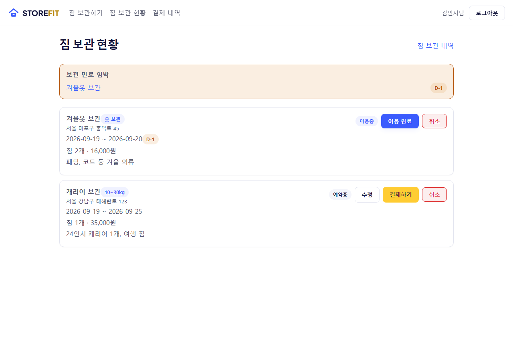
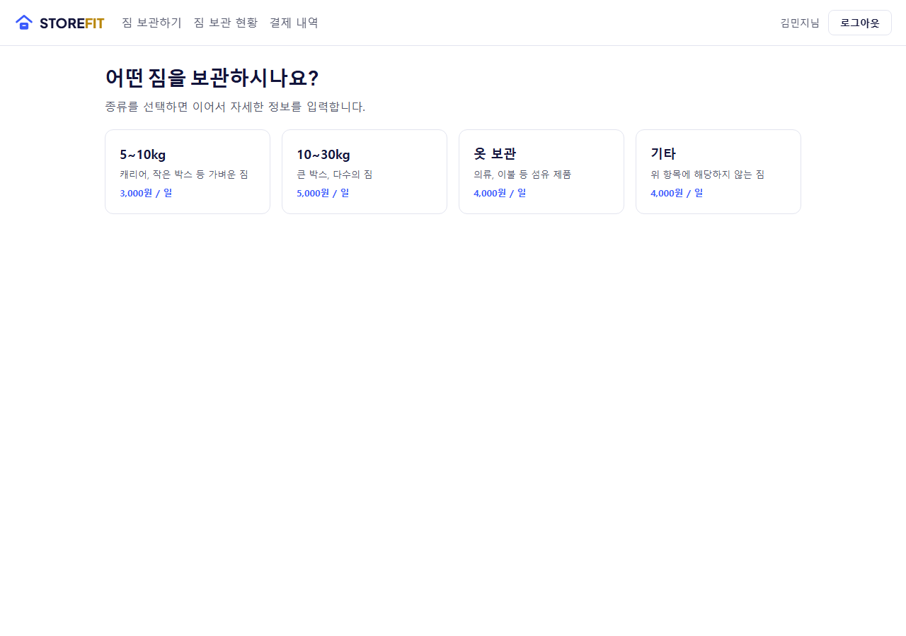
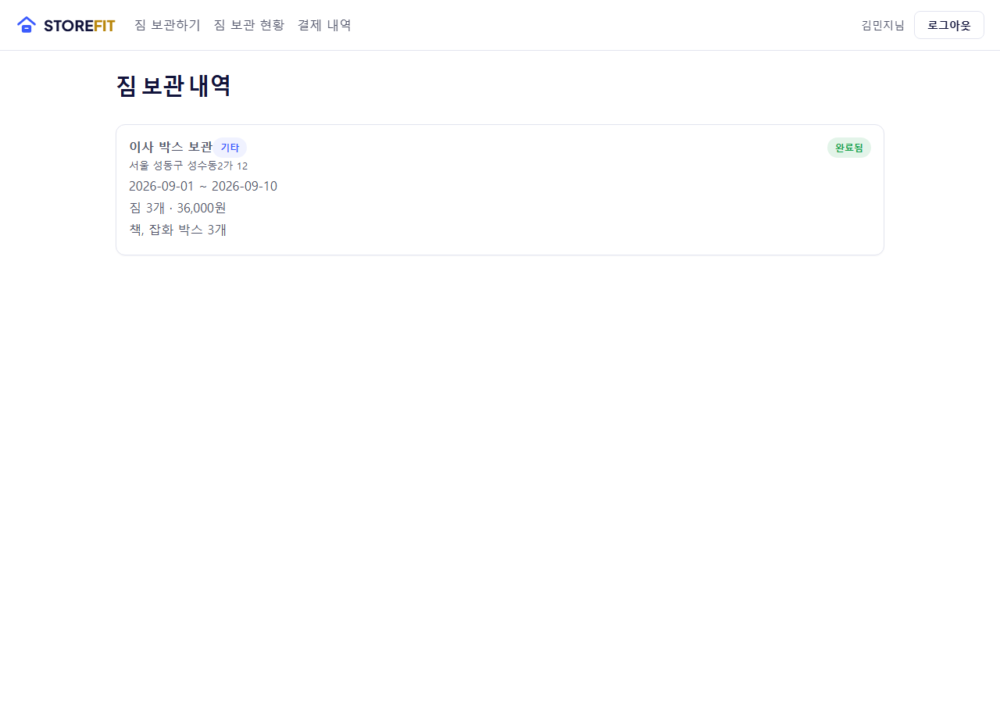
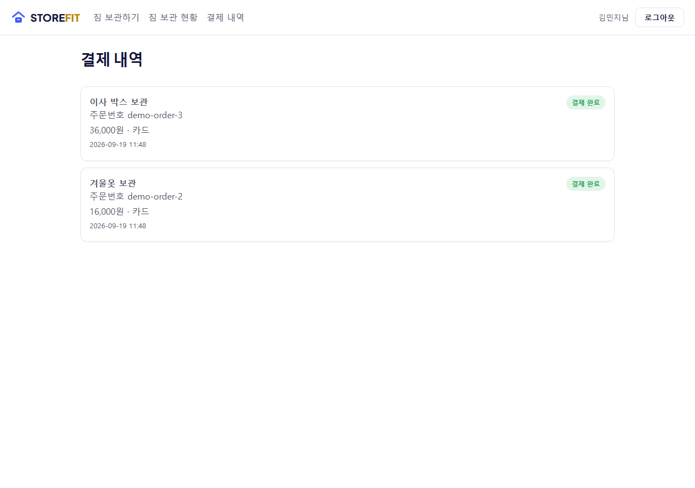
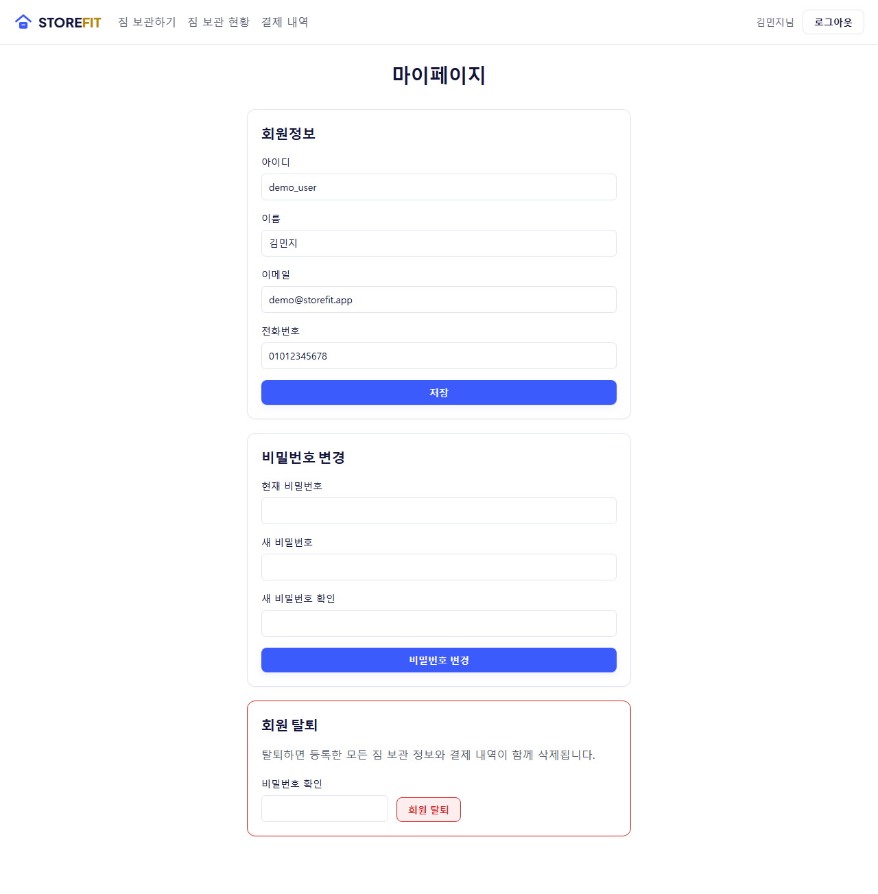

# StoreFit

대학생·1인 가구를 위한 개인용 짐보관 관리 서비스입니다. 어디에 무엇을 맡겼는지, 얼마 동안, 얼마에 보관 중인지를 한 곳에서 기록하고, 실제 결제까지 연동해서 관리합니다.

혼자서 기획부터 백엔드/프론트엔드/결제 연동/배포 준비까지 진행한 프로젝트입니다.


## 주요 기능

- **회원 인증** — 아이디/비밀번호 기반 JWT 인증, 아이디 찾기·비밀번호 재설정, 세션 만료 시 자동 로그아웃
- **짐 보관 등록 & 상태 관리** — 짐 종류(5~10kg / 10~30kg / 옷 보관 / 기타)별 일일 요금 자동 계산, 예약중 → 픽업중 → 이용중 → 완료 상태를 서버에서 검증하며 전이
- **실 결제 연동** — Toss Payments API로 결제 준비·승인 처리, 결제 완료 전에는 픽업 불가
- **보관 만료 임박 알림** — 이용중인 짐의 보관 종료일이 가까우면 대시보드에 배너로 표시
- **짐 보관 내역 / 결제 내역** — 완료된 보관 기록과 결제 기록을 각각 별도 페이지에서 조회
- **마이페이지** — 회원정보 조회/수정, 비밀번호 변경, 회원 탈퇴(보관·결제 기록 연쇄 삭제)

## 스크린샷

| 짐 보관 현황 | 짐 보관하기 |
|---|---|
|  |  |

| 짐 보관 내역 | 결제 내역 |
|---|---|
|  |  |

| 마이페이지 |
|---|
|  |

## 기술 스택

**Backend** — Java 17 · Spring Boot · Spring Security (JWT) · Spring Data JPA / Hibernate · Flyway · H2(dev) / MySQL(prod) · Toss Payments API

**Frontend** — React 19 · TypeScript · Vite · React Router · axios

**Infra** — Docker · Docker Compose · Nginx

## 기술적으로 눈여겨볼 부분

- **스키마 관리를 `ddl-auto`에서 Flyway로 전환**: 개발 중 "코드를 수정하고 재시작하면 회원 데이터가 사라진다"는 증상을 실제로 재현해서, `ddl-auto: update`가 기존 데이터가 있는 테이블에 NOT NULL 컬럼을 추가하지 못하고 조용히 실패한다는 근본 원인을 로그 분석으로 확인했습니다. 이후 스키마 변경을 전부 버전 관리되는 Flyway 마이그레이션으로 옮기고, Hibernate는 검증만 하도록 바꿔서 같은 문제가 재발하면 즉시 실패하도록 만들었습니다.
- **결제 상태와 보관 상태를 하나의 흐름으로 연결**: `Store` 엔티티에 상태 머신(예약중→픽업중→이용중→완료)을 두고, 각 전이마다 소유자 확인과 결제 완료 여부를 서버에서 강제합니다. 결제는 Toss Payments 샌드박스 API로 준비(ready)→승인(confirm) 흐름을 실제로 연동했습니다.
- **Docker로 배포 전 MySQL 호환성 검증**: 로컬 Docker로 백엔드+프론트엔드+MySQL을 실제로 빌드/실행해보면서, H2 전용 마이그레이션 문법이 실제 MySQL에서 깨지는 걸 미리 잡아 고쳤습니다.

## 로컬에서 실행하기

### Backend
```bash
cd backend
./gradlew bootRun
```
기본적으로 H2 파일 DB(`~/.luggage-storage`)를 사용하며 `http://localhost:8080`에서 실행됩니다.

### Frontend
```bash
cd frontend
npm install
npm run dev
```
`http://localhost:5173`에서 실행되며, `/api` 요청은 자동으로 백엔드로 프록시됩니다.

### Docker로 한 번에 실행 (MySQL 포함)
```bash
cp .env.example .env   # 값 채운 뒤
docker compose up -d --build
```
자세한 배포 절차는 [DEPLOYMENT.md](DEPLOYMENT.md)를 참고하세요.

### 테스트
```bash
cd backend
./gradlew test
```
