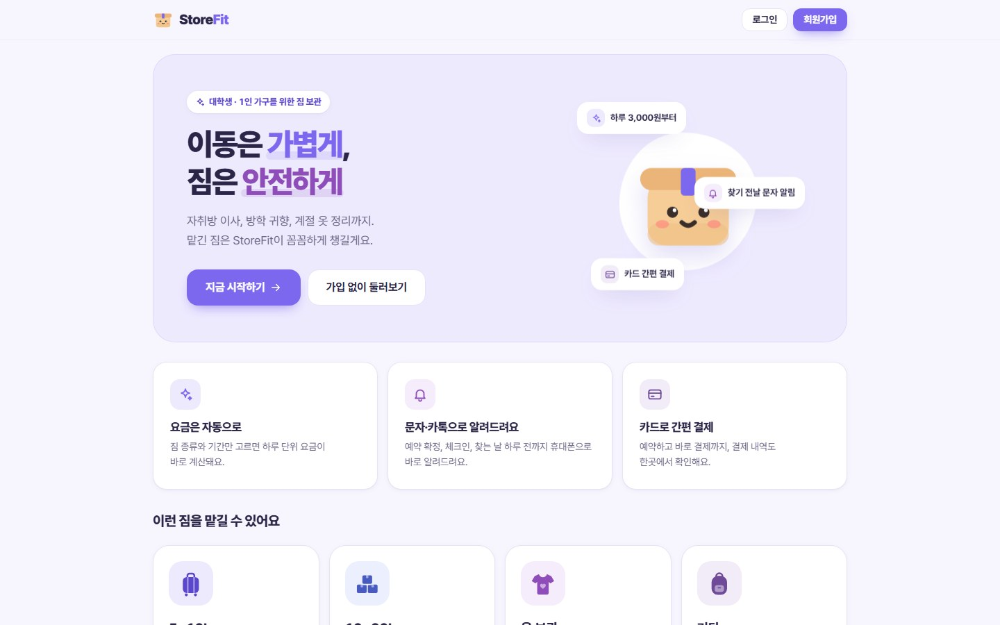
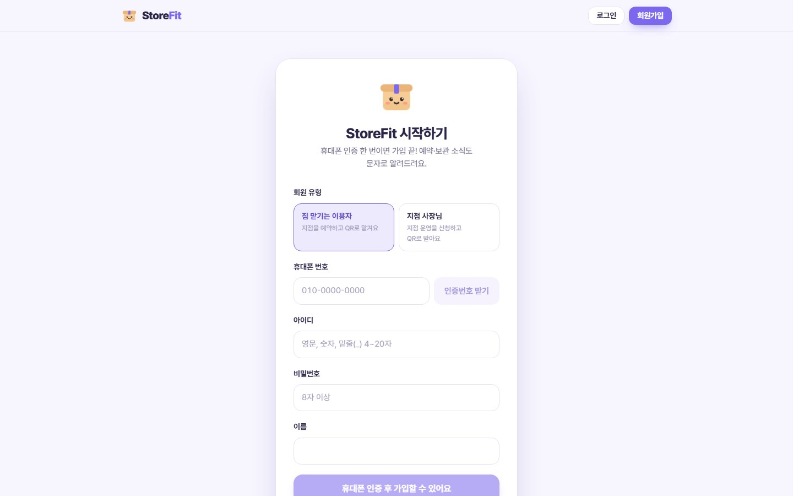
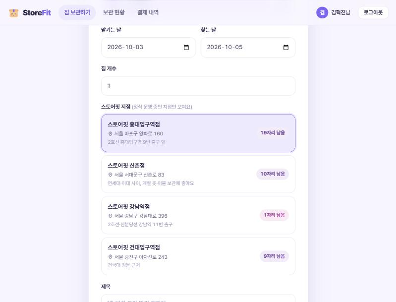
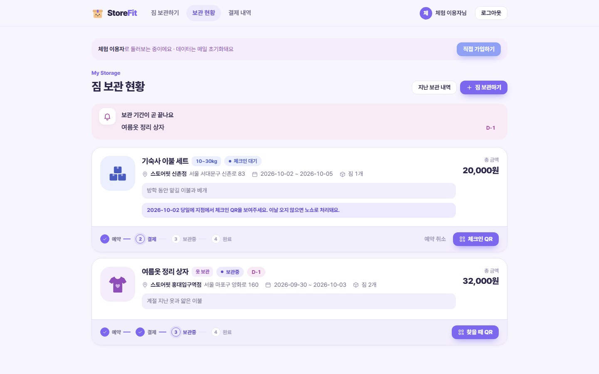
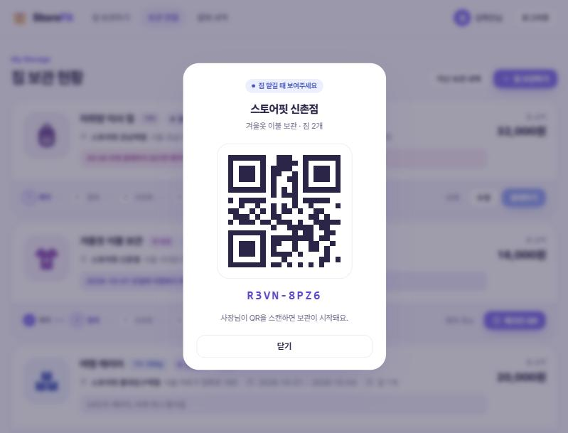
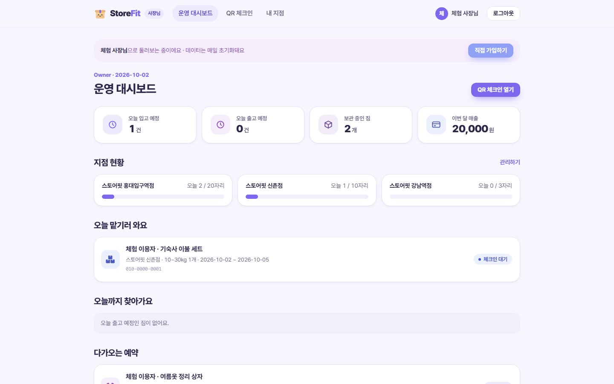
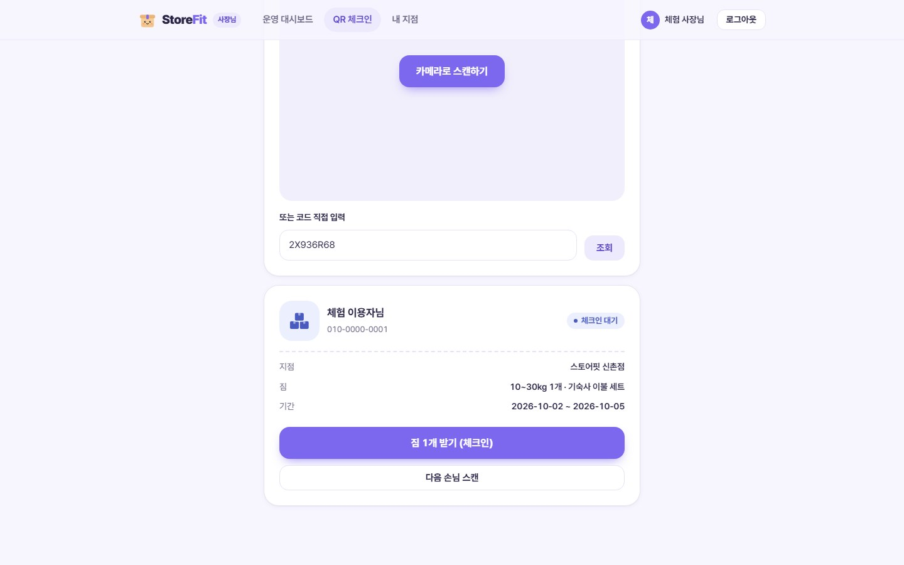
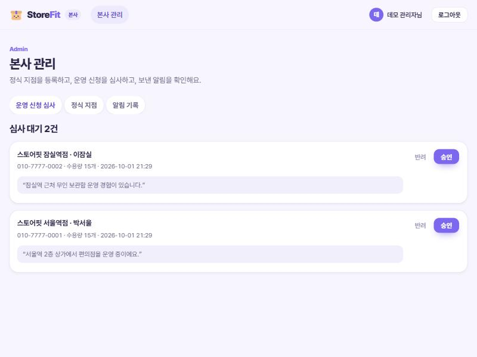

# StoreFit

대학생·1인 가구를 위한 **짐 보관 예약 플랫폼**입니다. 이용자는 스토어핏 정식 지점을 골라 예약·결제하고, 지점 사장님은 QR을 스캔해 짐을 받고 돌려줍니다. 본사 관리자는 지점을 등록하고 운영 신청을 심사합니다.

**🔗 서비스: https://storefit-khj.vercel.app**
- 로그인 화면의 **이용자로 둘러보기 / 사장님으로 둘러보기**로 가입 없이 바로 써볼 수 있습니다.
- 무료 서버라 오랜만에 접속하면 서버가 깨어나는 데 최대 1분 걸립니다. 그동안 "서버를 깨우는 중" 안내가 보입니다.



## 주요 기능

**이용자**
- **휴대폰 인증 가입** — 인증번호 발송·확인 후 일회용 토큰으로 가입. 아이디 찾기·비밀번호 재설정·번호 변경도 같은 인증을 쓴다
- **지점 예약** — 날짜를 고르면 지점마다 그 기간에 남은 자리를 보여주고(목록, 카카오 지도 키를 넣으면 지도에도 표시), 짐 종류·개수·기간으로 요금 자동 계산
- **결제와 체크인 QR** — 결제가 끝나면 체크인 QR(+8자리 코드) 발급. 예약 후 30분 안에 결제하지 않으면 자동 취소
- **취소·환불** — 시작 전날까지 전액, 시작일부터 50% 부분 환불
- **문자·카카오 알림톡** — 예약 확정, 체크인·체크아웃, 찾는 날 하루 전, 연체, 환불, 자동 취소, 노쇼

**지점 사장님**
- **정식 지점 운영 신청** — 본사가 등록한 지점 중에서 신청하고, 승인되면 운영 시작
- **QR 체크인/체크아웃** — 카메라로 QR을 스캔하거나 코드를 입력하면 예약 내용을 먼저 보여주고, 확인을 누르면 처리
- **운영 대시보드** — 오늘 입고·출고 예정, 보관 중인 짐, 이번 달 매출, 지점별 사용률, 연체 짐과 연체료

**가입 없이 둘러보기**
- 로그인 화면의 **이용자로 둘러보기 / 사장님으로 둘러보기** — 휴대폰 인증 없이 체험 계정으로 들어가서 보관 중인 짐, 체크인 QR, 사장님 대시보드와 QR 체크인을 바로 써볼 수 있다. 체험 데이터는 매일 처음 상태로 돌아간다

**본사 관리자**
- 정식 지점 등록·수정(주소 검색 → 좌표 자동 변환), 운영 신청 승인·반려, 문자·알림톡 발송 기록

## 스크린샷

| 휴대폰 인증 가입 | 지점 선택 (남은 자리) |
|---|---|
|  |  |

| 보관 현황 (결제 마감·체크인 안내) | 체크인 QR |
|---|---|
|  |  |

| 사장님 대시보드 | QR 체크인 |
|---|---|
|  |  |

| 본사 관리 · 운영 신청 심사 |
|---|
|  |

## 예약 흐름

```
예약 ──(30분 안에 결제)──▶ 결제 완료 ──(시작일, 사장님 QR 스캔)──▶ 보관 중 ──(사장님 QR 스캔)──▶ 완료
  │                          │                                     │
  └─ 30분 지나면 자동 취소     ├─ 시작 전날까지 취소: 전액 환불          └─ 찾는 날이 지나면 연체 알림·연체료
     (EXPIRED)                ├─ 시작일 취소: 50% 환불
                              └─ 시작일에 안 오면 노쇼 (NO_SHOW)
```

보관 시작·종료는 이용자가 직접 바꿀 수 없고, **지점 사장님이 QR을 스캔해야만** 바뀝니다. 처음 버전에서는 이용자가 "픽업 완료"·"보관 완료" 버튼을 직접 눌렀는데, 그러면 실제로 짐을 맡겼는지 아무도 검증할 수 없다는 한계가 있어서 운영자 확인 흐름으로 바꿨습니다.

## 기술 스택

**Backend** — Java 17 · Spring Boot 4 · Spring Security (JWT + 리프레시 토큰) · Spring Data JPA · Flyway · PostgreSQL · Testcontainers
**Frontend** — React 19 · TypeScript · Vite · React Router · axios · qrcode / qr-scanner · 카카오 지도 SDK
**외부 연동** — 결제(PG) API · 솔라피(문자·카카오 알림톡) · Supabase Storage(S3 호환) · 다음 우편번호
**배포** — Supabase(PostgreSQL·Storage) · Render(Docker) · Vercel · GitHub Actions(CI, 하루 한 번 서버 깨우기)

## 기술적으로 눈여겨볼 부분

### 1. 동시 예약으로 정원이 넘치는 문제 — 비관적 락으로 해결하고 테스트로 증명
지점마다 하루 수용량이 있어서, 예약할 때 "기간 중 가장 붐비는 날의 짐 개수 + 새 짐 ≤ 수용량"을 확인합니다. 하지만 여러 요청이 동시에 들어오면 모두 같은 "남은 자리"를 보고 함께 저장해 버립니다.
- 예약을 만들 때 지점 행을 `SELECT ... FOR UPDATE`로 잠가서 같은 지점의 예약을 한 줄로 처리하게 했습니다.
- 실제 PostgreSQL 컨테이너에서 **수용량 5인 지점에 20명이 동시에 예약**하는 테스트를 만들었고, 정확히 5건만 성공합니다.
- **락을 빼고 같은 테스트를 돌리면 10건이 예약되는 것**(정원 2배 초과)을 확인해서, 락이 실제로 필요하다는 걸 증명했습니다.

### 2. 승인 처리에서 발생한 교착 상태(deadlock) 해결
같은 지점에 여러 사장님이 신청한 상태에서 관리자가 여러 신청을 동시에 승인하면, 한 명만 성공하고 나머지는 자동 반려돼야 합니다. 동시 승인 테스트를 돌려 보니 PostgreSQL이 **deadlock**을 감지했습니다.
- 원인: 각 요청이 "자기 신청 → 지점" 순서로 잠그고, 그다음 같은 지점의 다른 신청(다른 요청이 잠근 행)을 반려하려다 서로를 기다렸습니다.
- 해결: 락 순서를 항상 **지점 → 신청**으로 통일했습니다. 이후 5건 동시 승인에서 정확히 1건만 성공합니다.

### 3. 결제 마감과 결제 승인의 경쟁 상태
미결제 예약은 30분 뒤 스케줄러가 자동 취소하는데, 사용자가 결제창에서 결제하는 바로 그 순간에 취소되면 "돈은 나갔는데 예약은 없는" 상태가 될 수 있습니다.
- 결제 승인 직전에 예약 행을 잠그고 아직 결제 가능한 상태인지 다시 확인합니다. 이미 취소됐다면 **PG 승인 API를 아예 호출하지 않아서** 돈이 빠져나가지 않습니다(테스트로 검증).
- 결제창을 연 사람에게는 최소 10분을 보장하도록 마감 시각을 늘려 줍니다.

### 4. 휴대폰 인증과 로그인 유지
- 인증번호는 해시로만 저장하고, 재전송 60초·시간당 5회·입력 5회 제한으로 문자 비용과 무작위 대입을 막았습니다. 번호를 바꿔 가며 문자를 보내게 하는 남용은 IP별 한도(프록시를 거친 원래 IP 기준)와 하루 전체 상한으로 막습니다.
- 인증에 성공하면 **목적(가입/아이디 찾기/비밀번호 재설정/번호 변경)과 번호에 묶인 일회용 토큰**을 줘서, 인증과 실제 요청 사이에 번호를 바꿔치기하거나 가입용 인증으로 비밀번호를 바꾸는 걸 막습니다.
- 액세스 토큰(30분) + 리프레시 토큰(14일, 해시 저장·사용할 때마다 교체). **이미 교체된 토큰이 다시 오면 탈취로 보고 그 회원의 로그인을 모두 끊습니다.** 프론트는 만료 시 여러 요청이 동시에 실패해도 갱신을 한 번만 하도록 처리했습니다.

### 5. 알림은 트랜잭션이 커밋된 뒤에, 비동기로
문자 API를 예약 저장 트랜잭션 안에서 부르면, 저장이 롤백돼도 "예약 확정" 문자가 나가거나 문자 API가 느릴 때 요청 전체가 기다립니다. 알림은 트랜잭션 안에서 기록만 남기고 `@TransactionalEventListener(AFTER_COMMIT)` + `@Async`로 커밋 후에 보내며, 결과(발송/실패·사유)를 관리자 화면에서 볼 수 있습니다. 카카오 알림톡 템플릿이 승인된 알림만 알림톡으로, 나머지는 문자로 자동으로 나갑니다.

### 6. 스키마 관리와 DB 전환
- 개발 중 "재시작하면 회원 데이터가 사라진다"는 증상을 재현해서, `ddl-auto: update`가 데이터가 있는 테이블에 NOT NULL 컬럼을 추가하지 못하고 조용히 실패한다는 원인을 찾았고, 모든 스키마 변경을 Flyway 마이그레이션으로 옮겼습니다.
- 배포 DB를 Supabase(PostgreSQL)로 정하면서 MySQL·H2 전용 문법을 PostgreSQL로 옮기고, 테스트도 H2 대신 Testcontainers로 **배포와 같은 DB**에서 돌립니다.
- 배포 서버(UTC)에서 "오늘"이 어제가 되는 문제를 막기 위해 날짜 계산은 한국 시간 `Clock`으로 하고, 테스트에서는 고정된 `Clock`으로 환불·체크인 날짜 규칙을 검증합니다.

## 문제 해결 기록

배포한 뒤 실제로 겪은 문제와 해결 과정입니다.

### 1. 배포하자마자 인증 문자가 오지 않음 — 발송 기록으로 원인을 바로 찾음
- **증상**: 가입 화면에서 인증번호를 요청하면 성공 응답은 오는데 문자가 오지 않았습니다.
- **원인 찾기**: 알림은 발송 결과(성공/실패·사유)를 `notifications` 테이블에 남기도록 만들어 두었기 때문에, 서버 로그를 뒤지지 않고 DB 한 줄로 원인을 확인했습니다. 솔라피가 `403 허용되지 않은 IP에서 접근`으로 거절하고 있었습니다. API 키에 걸린 IP 제한에 Render 서버의 나가는 IP가 없었습니다.
- **해결**: 솔라피 API 키의 허용 IP를 정리했고, 다음 요청부터 `SENT`로 바뀐 것을 확인했습니다.
- **배운 점**: 외부 API 연동은 "보냈다"가 아니라 "결과가 어땠는지"까지 저장해야 운영 중에 빠르게 대응할 수 있습니다.

### 2. 무료 서버가 잠들면 예약 스케줄러도 멈춤
- **증상**: Render 무료 서버는 15분 동안 요청이 없으면 잠듭니다. 처음에는 GitHub Actions로 10분마다 깨워 두었는데, 무료 사용 시간(월 750시간)을 다른 프로젝트와 나눠 쓰고 있어서 둘 다 24시간 깨워 두면 월 중순에 시간이 바닥납니다.
- **문제**: 깨워 두지 않으면 "매일 0시 5분 노쇼 처리", "매일 오전 10시 알림" 같은 정해진 시각의 작업이 서버가 자는 동안 실행되지 않습니다.
- **해결**:
  - 정해진 시각에 한 번 돌리는 대신, **깨어 있는 동안 10분마다 밀린 일을 따라잡도록** 바꿨습니다. 노쇼 처리는 "시작일이 지났는데 체크인 안 한 예약"을 찾는 방식이라 언제 돌려도 결과가 같습니다.
  - 하루 한 번만 해야 하는 알림은 `daily_job_runs` 테이블에 `(작업, 날짜)`를 먼저 넣고(`ON CONFLICT DO NOTHING`), 넣는 데 성공했을 때만 보냅니다. 서버가 여러 번 깨어나도 **알림이 중복으로 나가지 않습니다.** 발송이 실패해 롤백되면 날짜 기록도 함께 취소돼서 다음에 다시 시도합니다.
  - 서버는 하루 한 번(오전 10시 5분)만 깨우고, 나머지는 접속할 때 깨어납니다. 프론트엔드는 사이트를 열자마자 서버를 깨우기 시작하고, 깨어나는 동안 안내를 띄우고, API 요청을 기다렸다가 보냅니다.

### 3. 포트폴리오를 보는 사람이 써볼 방법이 없음 — 체험 계정
- **문제**: 가입에 휴대폰 인증이 필수라서, 링크를 받은 사람이 본인 번호를 인증하지 않으면 아무 화면도 볼 수 없었습니다. 또 지점 운영 사장님이 없어서 예약할 지점이 0개였습니다.
- **해결**: 로그인 화면에 **이용자로 / 사장님으로 둘러보기**를 넣었습니다.
  - 체험 사장님은 지점 세 곳을 운영하고, 체험 이용자는 보관 중인 짐·오늘 맡길 짐(QR)·지난 내역을 갖고 시작합니다. 둘러보는 사람이 직접 QR 체크인까지 해볼 수 있습니다.
  - 여러 사람이 같이 쓰는 계정이라 보호 장치를 두었습니다. 비밀번호는 서버가 켜질 때마다 아무도 모르는 값으로 바뀌어 체험하기 API로만 들어갈 수 있고, 문자를 보내지 않으며, 이름·번호를 바꿀 수 없습니다. 체험 결제를 취소해도 결제사를 호출하지 않고, 데이터는 하루 한 번 처음 상태로 돌아갑니다.

### 4. 인증 문자로 비용이 새는 구멍 — 프록시 뒤에서 진짜 IP 찾기
- **문제**: 인증번호 발송은 로그인 없이 부를 수 있는데, 제한은 번호당 시간 5회뿐이었습니다. 번호를 바꿔 가며 자동으로 요청하면 문자 충전금과 일일 발송 한도가 바닥나서 실제 사용자가 가입하지 못하게 됩니다.
- **해결**: IP별 시간당 한도와 하루 전체 상한을 추가했습니다. 요청이 Vercel → Render를 거쳐 오기 때문에 서버가 보는 주소는 프록시 주소라서, `X-Forwarded-For`의 맨 앞(원래 사용자 주소)을 기준으로 셉니다. 하루 상한은 DB에서 세기 때문에 서버가 잠들었다 깨어나도 초기화되지 않습니다.

### 5. 한글이 단어 중간에서 끊겨 화면이 깨짐
- **증상**: 좁은 버튼이나 카드에서 "사장님으로 둘러보 / 기"처럼 한 글자씩 다음 줄로 넘어갔습니다. 브라우저는 기본적으로 한글을 글자 단위로 줄바꿈하기 때문입니다.
- **해결**: 전체에 `word-break: keep-all`(띄어쓰기 단위 줄바꿈)과 `text-wrap: pretty`(마지막 줄에 한 글자만 남지 않게)를 적용하고, 긴 URL·코드는 넘칠 때만 끊도록 `overflow-wrap`을 두었습니다.
- **검증**: 화면을 하나씩 눈으로 보는 대신, 모든 글자의 줄 위치를 재서 "단어가 두 줄로 쪼개진 곳"을 찾는 스크립트를 만들어 모든 화면을 360~1100px 너비에서 검사했습니다. 수정 전 설정에서는 문제를 잡아내고, 수정 후에는 0건인 것을 확인했습니다.

## 테스트

```bash
cd backend && ./gradlew test   # Docker 필요 (PostgreSQL 컨테이너)
```

77개 테스트 — 서비스 단위 테스트(요금·환불·수용량 규칙, 인증 문자 하루 상한) + 실제 DB 통합 테스트(동시 예약·동시 승인, 결제→QR→체크인→체크아웃 전체 흐름, 자동 취소·노쇼·연체, 하루 한 번 알림, 휴대폰 인증·IP 한도·리프레시 토큰, 체험 계정, 역할별 접근 제어). GitHub Actions CI에서 푸시마다 실행됩니다.

## 실행·배포

- 로컬 실행과 Supabase·Render·Vercel·솔라피 배포 순서: [DEPLOYMENT.md](DEPLOYMENT.md)
