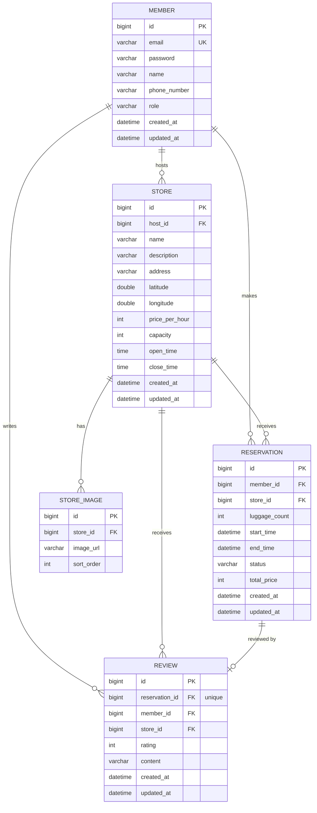

# ERD

## 관계 설명

- `MEMBER` 1 — N `STORE` : 한 회원(호스트)이 여러 보관소를 등록할 수 있음
- `MEMBER` 1 — N `RESERVATION` : 한 회원이 여러 예약을 만들 수 있음
- `STORE` 1 — N `RESERVATION` : 한 보관소는 여러 예약을 받을 수 있음
- `STORE` 1 — N `STORE_IMAGE` : 보관소 이미지는 여러 장 등록 가능
- `RESERVATION` 1 — 1 `REVIEW` : 예약 1건당 리뷰는 최대 1개
