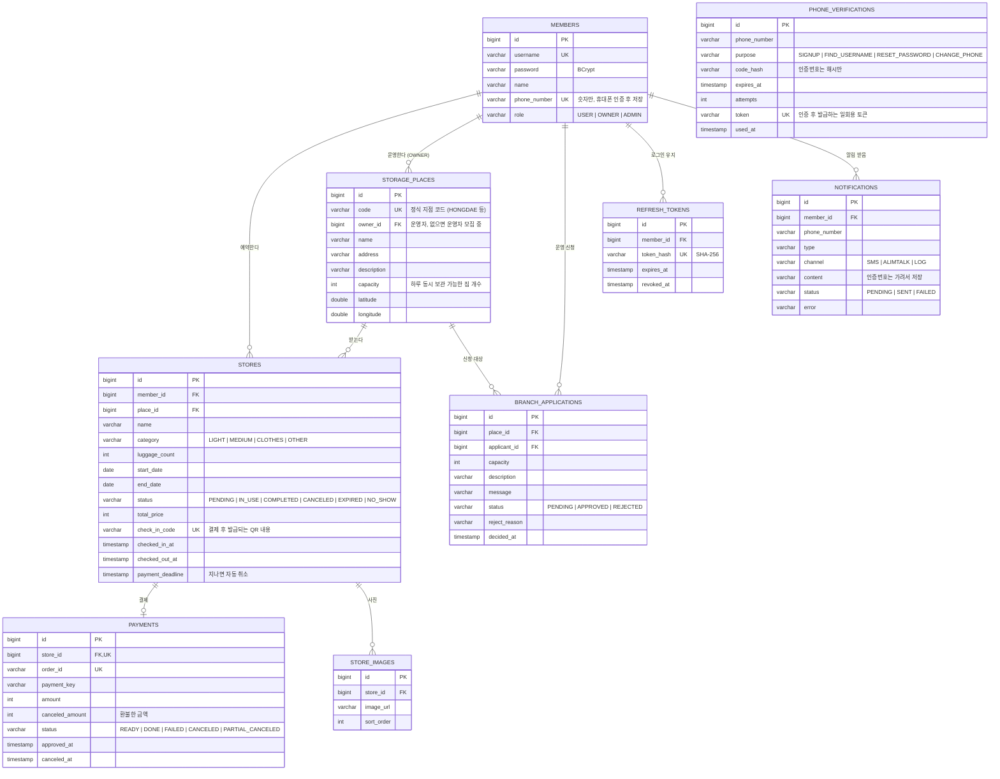

# ERD

스키마는 Flyway 마이그레이션(`backend/src/main/resources/db/migration`, V1~V8)이 만든다. 아래는 현재 기준이다.

```mermaid
erDiagram
    MEMBERS ||--o{ STORES : "예약한다"
    MEMBERS ||--o{ STORAGE_PLACES : "운영한다 (OWNER)"
    MEMBERS ||--o{ BRANCH_APPLICATIONS : "운영 신청"
    MEMBERS ||--o{ REFRESH_TOKENS : "로그인 유지"
    MEMBERS ||--o{ NOTIFICATIONS : "알림 받음"
    STORAGE_PLACES ||--o{ STORES : "받는다"
    STORAGE_PLACES ||--o{ BRANCH_APPLICATIONS : "신청 대상"
    STORES ||--o| PAYMENTS : "결제"
    STORES ||--o{ STORE_IMAGES : "사진"

    MEMBERS {
        bigint id PK
        varchar username UK
        varchar password "BCrypt"
        varchar name
        varchar phone_number UK "숫자만, 휴대폰 인증 후 저장"
        varchar role "USER | OWNER | ADMIN"
    }

    STORAGE_PLACES {
        bigint id PK
        varchar code UK "정식 지점 코드 (HONGDAE 등)"
        bigint owner_id FK "운영자, 없으면 운영자 모집 중"
        varchar name
        varchar address
        varchar description
        int capacity "하루 동시 보관 가능한 짐 개수"
        double latitude
        double longitude
    }

    BRANCH_APPLICATIONS {
        bigint id PK
        bigint place_id FK
        bigint applicant_id FK
        int capacity
        varchar description
        varchar message
        varchar status "PENDING | APPROVED | REJECTED"
        varchar reject_reason
        timestamp decided_at
    }

    STORES {
        bigint id PK
        bigint member_id FK
        bigint place_id FK
        varchar name
        varchar category "LIGHT | MEDIUM | CLOTHES | OTHER"
        int luggage_count
        date start_date
        date end_date
        varchar status "PENDING | IN_USE | COMPLETED | CANCELED | EXPIRED | NO_SHOW"
        int total_price
        varchar check_in_code UK "결제 후 발급되는 QR 내용"
        timestamp checked_in_at
        timestamp checked_out_at
        timestamp payment_deadline "지나면 자동 취소"
    }

    PAYMENTS {
        bigint id PK
        bigint store_id FK,UK
        varchar order_id UK
        varchar payment_key
        int amount
        int canceled_amount "환불한 금액"
        varchar status "READY | DONE | FAILED | CANCELED | PARTIAL_CANCELED"
        timestamp approved_at
        timestamp canceled_at
    }

    STORE_IMAGES {
        bigint id PK
        bigint store_id FK
        varchar image_url
        int sort_order
    }

    PHONE_VERIFICATIONS {
        bigint id PK
        varchar phone_number
        varchar purpose "SIGNUP | FIND_USERNAME | RESET_PASSWORD | CHANGE_PHONE"
        varchar code_hash "인증번호는 해시만"
        timestamp expires_at
        int attempts
        varchar token UK "인증 후 발급하는 일회용 토큰"
        timestamp used_at
    }

    REFRESH_TOKENS {
        bigint id PK
        bigint member_id FK
        varchar token_hash UK "SHA-256"
        timestamp expires_at
        timestamp revoked_at
    }

    NOTIFICATIONS {
        bigint id PK
        bigint member_id FK
        varchar phone_number
        varchar type
        varchar channel "SMS | ALIMTALK | LOG"
        varchar content "인증번호는 가려서 저장"
        varchar status "PENDING | SENT | FAILED"
        varchar error
    }
```

## 동시성 제어에 쓰는 락

| 상황 | 잠그는 행 | 막는 문제 |
|---|---|---|
| 예약 생성·수정 | `storage_places` | 동시 예약으로 수용량 초과 |
| 운영 신청 승인 | `storage_places` → `branch_applications` (순서 고정) | 한 지점에 운영자 두 명, 교착 상태 |
| 결제 승인 · 자동 취소 · 예약 취소 | `stores` | 취소된 예약 결제, 이중 환불 |
| QR 체크인·체크아웃 | `stores` (코드로 조회) | 같은 QR 두 번 처리 |
| 휴대폰 인증 토큰 사용 · 리프레시 토큰 교체 | 해당 토큰 행 | 토큰 재사용 |
